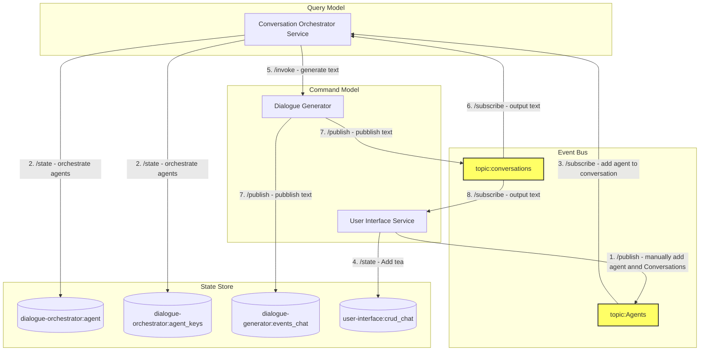

# CupOfTea

# CupOfTea Project

## Overview

The CupOfTea project is a microservices-based application designed to simulate a dynamic conversation environment where virtual agents, representing individuals, participate in a virtual "cup of tea" conversation. The application leverages a distributed architecture, incorporating services for user interaction, conversation orchestration, and dialogue generation. It utilizes Dapr for microservices communication, state management, and event-driven interactions, making extensive use of Dapr's capabilities to facilitate a seamless, scalable conversation experience.

## Diagram



## Architecture Components

- **UI Service**: Provides the interface for user interactions, allowing users to manually add agents to the conversation and visualize the ongoing dialogue.

- **Conversation Orchestrator Service (CO)**: Manages the flow of the conversation, including adding agents to the conversation, checking the "tea" state for each agent to ensure they have enough "tea" (tokens) to continue participating, and invoking the Dialogue Generator for text generation.

- **Dialogue Generator (DG)**: Responsible for generating dialogue content for agents based on the conversation context. It consumes "tea" (tokens) for each piece of text generated, simulating the consumption of resources as agents participate in the conversation.

- **Event Bus**: A loosely coupled messaging pattern where senders (or publishers) publish messages to a topic, to which subscribers subscribe. Dapr supports the pub/sub pattern between applications. It includes:
  - `agents` for managing agent participation.
  - `conversations` for broadcasting conversation updates and generated dialogue.

- **State Store (Tea)**: A centralized store for managing the "tea" state, application state is anything an application wants to preserve beyond a single session. Dapr provides a key/value-based state and query APIs with pluggable state stores for persistence.

## Interaction Flow

1. **Agent Addition**: Users can manually add agents through the UI Service, which publishes the addition to the `topic:agents`.
2. **Tea Addition**: The UI Service also allows for the manual addition of "tea" (tokens) to agents, updating their state in the State Store.
3. **Agent Subscription**: The Conversation Orchestrator subscribes to `topic:agents` to add new agents to the conversation.
4. **Tea Check**: Before allowing an agent to participate, the CO checks the agent's "tea" levels in the State Store.
5. **Text Generation**: For participating agents, the CO invokes the DG to generate dialogue text.
6. **Tea Consumption**: The DG consumes "tea" from the agent's state in the State Store for each piece of text generated.
7. **Publish Dialogue**: The DG publishes the generated dialogue to `topic:conversations`.
8. **Output Dialogue**: The UI Service subscribes to `topic:conversations` to display the ongoing dialogue to users.

## Technologies

- **Dapr**: Used for service invocation, state management, and pub/sub messaging, facilitating communication and data management across services.
- **Kafka**: Provides the event bus functionality for pub/sub messaging between services.
- **Kubernetes**: Hosts and orchestrates the containerized microservices, providing scalability, resilience, and deployment management.

## Getting Started

To run the CupOfTea project locally or in a Kubernetes environment, ensure you have Dapr and Kubernetes configured. Each microservice can be deployed as a separate container, with Dapr sidecars enabling communication and state management. Refer to the individual service directories for specific build and deployment instructions.

### Local Development

1. Install [Dapr CLI](https://docs.dapr.io/getting-started/install-dapr-cli/)
2. Start Dapr: `dapr init`; in the current configuration this will spawn a dockerized local Dapr runtime with Zipking ([http://localhost:9411](http://localhost:9411)) and Redis ([http://localhost:6379](http://localhost:6379)) for state management. Use [Redis Insight](https://redis.io/insight/) for monitoring the states and event streams.
3. Configure resources (optional):
   - Check that `resources` directory contains the tools with desired functionality.
   - Add the `components` and `bindings` YAML files for each service, if you chose to use the [declarative approach](https://docs.dapr.io/developing-applications/building-blocks/pubsub/subscription-methods/#declarative-subscriptions) to the `resources` directory.
4. Run all the projects locally using the dapr file run: `dapr run -f dapr_local.yml`
5. Run each service with Dapr: `dapr run --app-id <service-name> --app-port <port> <command>` after navigating to each project folder:
  - user-interface: `dapr run --app-id user-interface --app-port 5200 --resources-path ../../resources -- python3 -m venv .venv && source .venv/bin/activate && pip install -r requirements.txt && streamlit run app.py --server.port 5200`
  - dialogue-generator: `dapr run --app-id dialogue-generator --app-port 5400 --dapr-http-port 3500 --app-protocol http --resources-path ../../resources -- python3 -m venv .venv && source .venv/bin/activate && pip install -r requirements.txt && python3 app.py`
  - dialogue-orchestrator: `dapr run --app-id dialogue-orchestrator --app-port 5300 --app-protocol grpc --resources-path ../../resources -- python3 -m venv .venv && source .venv/bin/activate && pip install -r requirements.txt && python3 app.py`


### Usage

- **User Interface**: Access the User Interface at [http://localhost:5200](http://localhost:5200)
  - **app**: Contain the slides with basic introduction to events, CRUD and Pub/Sub
  - **crud chat**: Is a simple chat which stores the messages in the state store, also used to maintaina a context.
  - **events chat**: Used to add agents in the "Register a Chat Agent" and trigger and when at least two agents are added the conversation can be started with a statement in the "Start a New Chat" window.
- **Dialogue Generator**: The Dialogue Generator service is invoked by the Conversation Orchestrator to generate dialogue text based on the conversation context.
- **Conversation Orchestrator**: The Conversation Orchestrator manages the flow of the conversation, including adding agents, checking "tea" levels, and invoking the Dialogue Generator for text generation. This will also export the conversations logs, is the main source of output.

### Test

  - Dialogue Generator Test from Shell

  ```
  curl -X POST http://localhost:3500/v1.0/invoke/dialogue-generator/method/generate -H "Content-Type: application/json" -d '{
    "agent": {
        "description": "Er fenomeno",
        "id": "76e28502-4ee4-4b49-82bf-b45afadff455",
        "name": "Giggino",
        "tea_amount_ml": 400
    },
    "message": "Hello, world!"
  }'
  ```

  Enjoy
